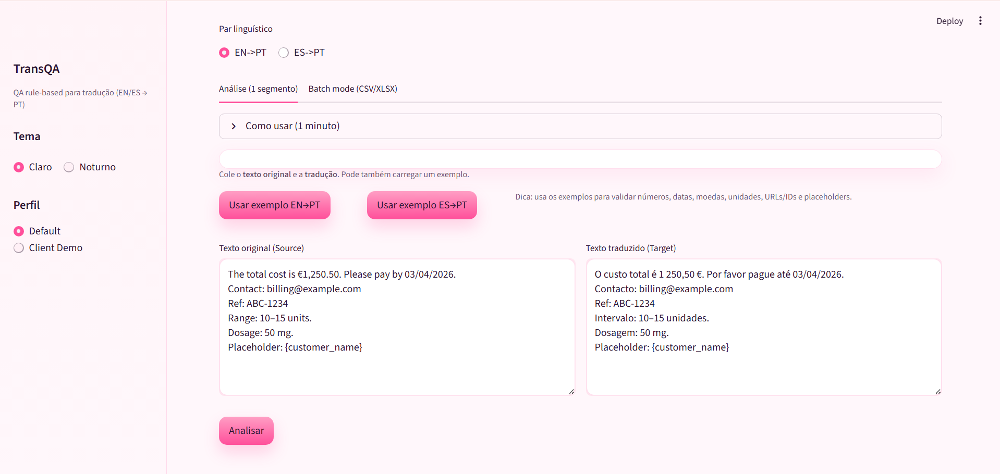
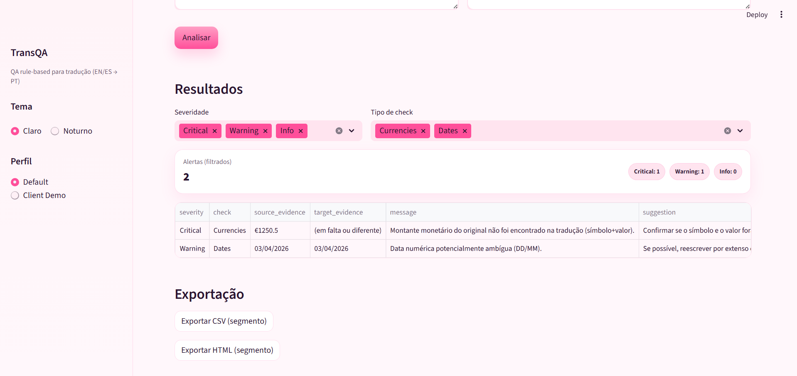
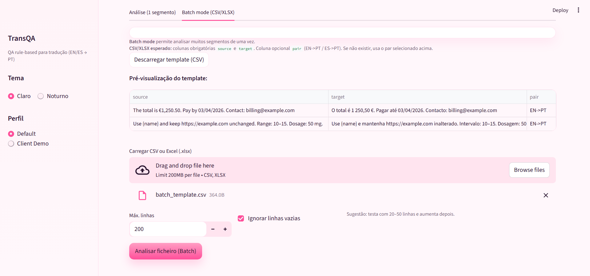
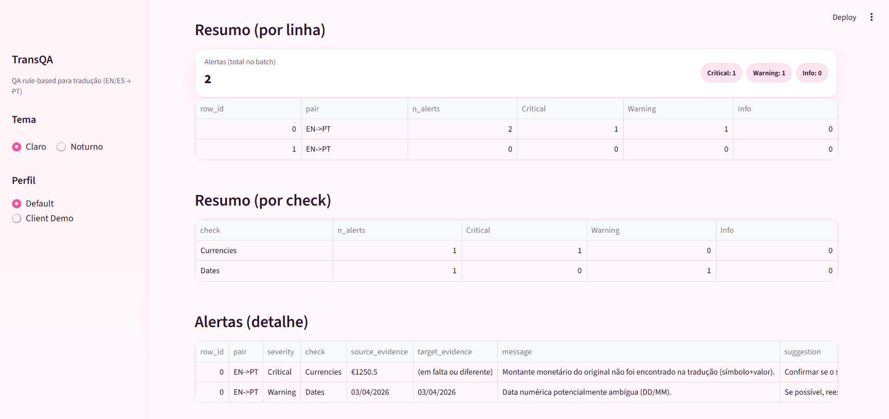

# TransQA — Quality Assurance (QA) para Tradução (EN/ES → PT)

TransQA é um protótipo de ferramenta de *Quality Assurance* para tradução, orientado a regras e configurável por cliente. O objetivo é detetar problemas frequentes em segmentos traduzidos (p.ex., números alterados, datas ambíguas, moedas/unidades omitidas, URLs/IDs não preservados), fornecendo alertas com evidências e sugestões de correção.

O projeto foi desenvolvido para ser **utilizável**, **reprodutível** e **facilmente extensível**, suportando perfis de configuração (por cliente/domínio) e avaliação automática com um conjunto “gold” de casos anotados.

---

## Funcionalidades principais

### Checks implementados (rule-based)
- **Dates** (datas numéricas; deteção e aviso de ambiguidade)
- **Numbers** (números gerais; com normalização PT/EN/ES e mitigação de falsos positivos em IDs)
- **Currencies** (montantes monetários; símbolo antes/depois do número)
- **Percentages** (percentagens com `%`)
- **Units** (valores com unidade)
- **Ranges** (intervalos: `10–15`, `10-15`)
- **Non-translate** (URLs, Emails, IDs)
- **Placeholders** (ex.: {name}, %s, tags HTML, \n; preservação de tokens de localização)

### Configuração por perfil (YAML)
- ativar/desativar checks
- definir símbolos monetários e lista de unidades
- ajustar regras (p.ex., aviso de datas ambíguas)

### Interface Streamlit
- introdução de texto fonte e tradução
- execução de QA e visualização de alertas (tabela)

### Avaliação automática (gold set)
- leitura de `data/gold_cases.csv`
- execução por perfil
- geração de resultados e métricas em `eval/`

## Resultados da avaliação (gold set)

Configuração: `config/default.yaml`  
Métrica: case-level por check.

 check | TP | FP | FN | F1 |
| --- | --- | --- | --- | --- |
| Currencies | 2 | 0 | 1 | 0.80 |
| Dates | 3 | 0 | 0 | 1.00 |
| Non-translate (Emails) | 1 | 0 | 0 | 1.00 |
| Non-translate (IDs) | 1 | 0 | 0 | 1.00 |
| Non-translate (URLs) | 1 | 0 | 1 | 0.67 |
| Numbers | 1 | 0 | 0 | 1.00 |
| Percentages | 2 | 0 | 0 | 1.00 |
| Placeholders | 0 | 1 | 4 | 0.00 |
| Ranges | 2 | 0 | 0 | 1.00 |
| Units | 3 | 0 | 0 | 1.00 |

---

## Exemplo rápido (single segment)

**Source**
```text
Hello {name}, your balance is € 1,250.50 due on 03/04/2026. Contact: help@company.com
```

**Target**

```text
Olá, o seu saldo é 1.250,50 € com vencimento em 03/04/2026. Contacto: help@company.com
```

**O que o TransQA deve sinalizar (exemplo)**

* **Placeholders**: `{name}` em falta (placeholder removido/alterado)
* (Opcional, dependendo das regras) **Dates**: data numérica potencialmente ambígua em contexto EN (03/04/2026)
* **Currencies/Numbers**: validação de preservação do valor monetário e do número (normalização EN/PT)

## Requisitos

- Python 3.10+ (recomendado)

Instalação via `requirements.txt` (inclui Streamlit, Pandas e PyYAML).

---

## Quickstart (correr localmente)

No PowerShell, na pasta onde queres clonar:

```powershell
git clone https://github.com/joanasofiab/transqa.git
cd transqa
python -m venv .venv
.\.venv\Scripts\Activate.ps1
python -m pip install -r requirements.txt
streamlit run app.py
````

Abrir no browser: `http://localhost:8501`

---

## Demo (UI)

Screenshots da interface (modo claro/noturno) e das principais funcionalidades:

### Análise (1 segmento)



### Batch mode (CSV/XLSX)


---

## Demo (UI)

Screenshots da interface (modo claro/noturno) e das principais funcionalidades:

### Análise (1 segmento)


### Batch mode (CSV/XLSX)


---

## Batch mode (CSV)

O TransQA também suporta análise em lote via upload de CSV (útil para revisão de muitos segmentos).

Exemplo incluído: `data/batch_example.csv`

### Formato do CSV

Colunas obrigatórias:

- `source` — texto original
- `target` — texto traduzido

Coluna opcional:

- `pair` — par linguístico por linha (`EN->PT` / `ES->PT`). Se não existir (ou estiver vazio), o sistema usa o par selecionado na interface.

### Exemplo mínimo

```csv
source,target,pair
"Hello {name}.","Olá {name}.",EN->PT
"Total: € 1,250.50","Total: 1.250,50 €",EN->PT
"Rango 10–15 mg.","Intervalo 10–15 mg.",ES->PT
````

### Como usar na interface

1. Abrir a app: `streamlit run app.py`
2. Na secção **Batch mode (CSV)**, carregar o ficheiro (ex.: `data/batch_example.csv`)
3. Clicar em **Analisar CSV (Batch)**
4. Fazer download dos resultados:

   * `transqa_batch_summary.csv` (resumo por linha)
   * `transqa_batch_alerts.csv` (alertas detalhados)
   * `transqa_batch_alerts.html` (relatório em HTML)

## Avaliação (gold set)

Correr a avaliação com o perfil default:

```powershell
python -m eval.evaluate
````

Outputs gerados:

* `eval/eval_results.csv`
* `eval/eval_summary.csv`
* `eval/eval_summary.txt`

Para correr a avaliação com outro perfil:

```powershell
$env:TRANSQA_CONFIG="config\client_demo.yaml"
python -m eval.evaluate
```
---

## Estrutura do projeto (visão geral)

```text
transqa/
  app.py
  config/
    default.yaml
    client_demo.yaml
  core/
    __init__.py
    models.py
    runner.py
  checks/
    __init__.py
    dates.py
    numbers.py
    currencies.py
    percentages.py
    units.py
    ranges.py
    nontranslate.py
    punctuation.py
  utils/
    __init__.py
    normalize.py
  data/
    gold_cases.csv
  eval/
    __init__.py
    evaluate.py
    eval_results.csv
    eval_summary.csv
    eval_summary.txt
  reports/
    html_report.py
  requirements.txt
  requirements-lock.txt
```

## Arquitetura (como o sistema funciona)

1. **Configuração (YAML)** define checks ativos e regras (p.ex., símbolos monetários, unidades, datas ambíguas).
2. **Runner** (`core/runner.py`) recebe `source`, `target`, `pair` e `config`, executa checks ativados e agrega alertas.
3. **Checks** (`checks/*.py`) devolvem uma lista de `Alert` (modelo em `core/models.py`) com:

   * severidade (`Critical`, `Warning`, `Info`)
   * nome do check
   * evidência em source/target
   * mensagem e sugestão
4. **UI** (`app.py`) apresenta resultados em tabela.

---

## Perfis de configuração (YAML)

Exemplo (padrão): `config/default.yaml`

* checks ativos: `checks.enabled`
* regras: `rules.*` (exemplos):

  * `warn_ambiguous_numeric_dates: true`
  * `currency_symbols: ["€", "$", "£"]`
  * `units: ["°C", "mg", "kg", "cm", "mm"]`

---

## Como adicionar um novo check (extensão)

1. Criar um ficheiro em `checks/` (ex.: `checks/placeholders.py`):

```python
from typing import List
from core.models import Alert

def check_placeholders(source: str, target: str) -> List[Alert]:
    alerts: List[Alert] = []
    return alerts
```

2. Ligar no runner (`core/runner.py`):

```python
from checks.placeholders import check_placeholders

if "placeholders" in enabled:
    alerts += check_placeholders(source, target)
```

3. Ativar no YAML:

```yaml
checks:
  enabled:
    - placeholders
```

4. Adicionar casos ao gold set (`data/gold_cases.csv`) e correr:

```powershell
python -m eval.evaluate
```

---

## Roadmap (extensões futuras)

* Batch mode (upload CSV de segmentos e relatório agregado)
* Exportação de relatório (CSV/HTML/PDF)
* Check de placeholders (ex.: `{name}`, `%s`, `\n`, etc.)
* Check terminológico (glossário por cliente/domínio)
* CLI estável para integração com pipelines de tradução

---

## Versões
- v1.0.0 — UI + batch CSV + export CSV/HTML + checks base + placeholders + gold set

---

## Licença

Projeto académico (uso educacional). Ajustar conforme requisitos da unidade curricular/instituição.